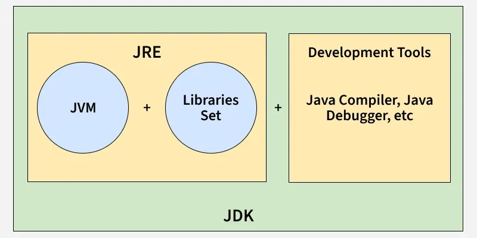

# <center>Introduction
In 1991, **James Gosling** at Sun Microsystems started Green Project:Oak but name was trademarked  -> Java{coffee}.

Earlier Programs written for Windows wouldn’t run on Mac.  
Mac programs wouldn’t run on Linux.

Java came with this powerful idea:  
“Write Once, Run Anywhere.”  
You write code → it becomes bytecode.  
JVM reads that bytecode, hence code runs on any machine that has JVM

In 2010, Oracle Corporation bought Sun Microsystems.  
Since then, Oracle manages Java.

---
### WHAT?
High-level, Object-Oriented, Platform independent, Compiled and interpreted Language

---
### HOW?
Other languages:  
You write code → compile → machine code → runs only on that OS.

Process :-

1. Java Compiler(Javac) converts **.java** into **.class**(Bytecode).  
Bytecode: Not human readable, Not machine code, A middle language.  
2. **JVM** (Java Virtual Machine) does further 3 things
    1. Loads your .class file into memory.
    2. Checks bytecode, No illegal memory access, No security issues
    3. Executes the code

Java is both. It is compiled into bytecode and then interpreted (and JIT-compiled) by the JVM at runtime.

---
## JVM vs JDK vs JRE

**JVM ?**  
A virtual computer inside your real computer that  
Executes bytecode, Manages memory, Does garbage collection, Ensures security




## Basic Syntax

```java
public class Ayush{  
    public static void main ( String args[] ){  
        System.out.println("Hello Java");  
    }  
}  
//Save file as Ayush.java
//Same name as class
```
Every line of code that runs in Java must be inside a class.   
The class name should always start with an uppercase first letter.  
The name of the Java file must match the class name.

<br>

---
## <center>Java Comments

    // Single-line comment
    /* 
        These are multiline
        comments
    */

---
